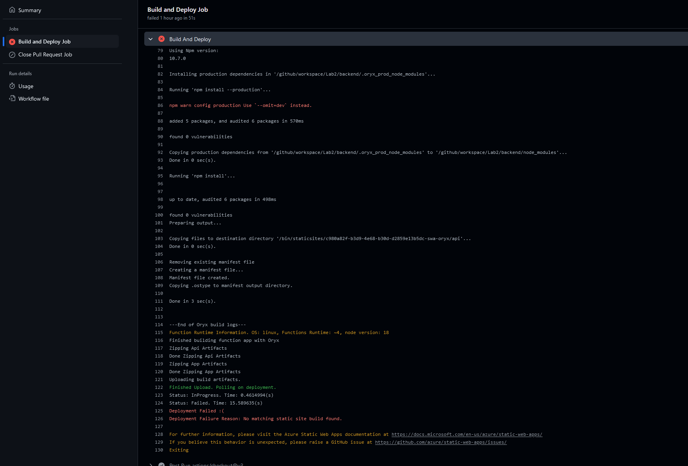
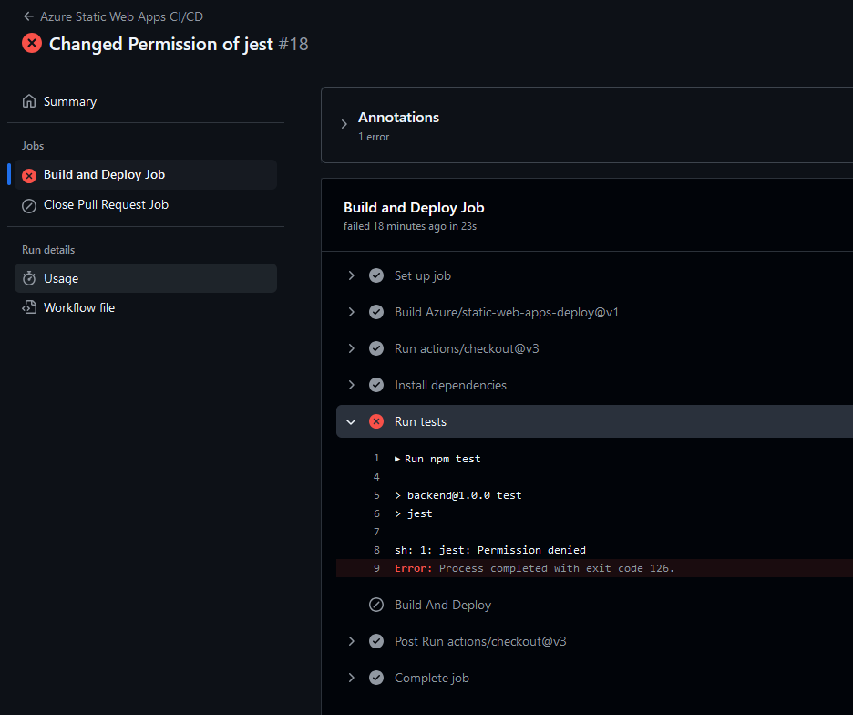
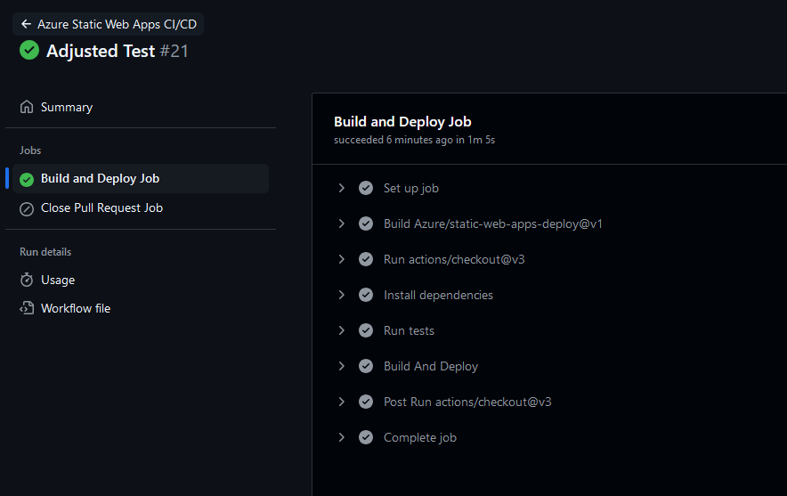
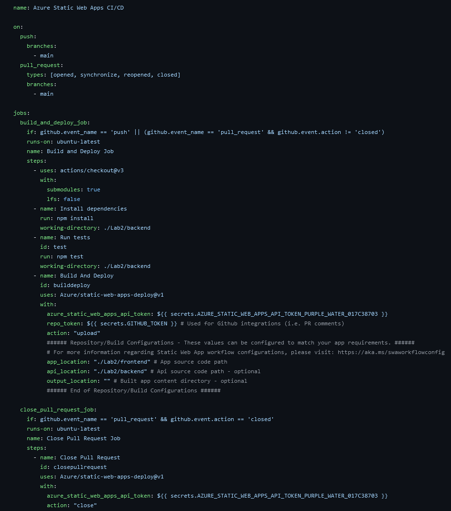

# Github Pipelines

## 3. Release Pipeline Approval

### Step 1: Open GitHub and Access Pull Requests
- Navigate to the **Pull Requests** section of your GitHub repository. section.

### Step 2: Set Base and Compare Branches
- Choose **release** as the base branch and main as the compare branch.

### Step 3: Create and Merge the Pull Request
- Click **Create Pull** Request to begin. Address any merge conflicts promptly, and once resolved, merge the changes into the **release** branch.

### Step 4: Wait for Redeployment
- Allow a few moments for the static web app to automatically redeploy. This confirms that the latest updates are live and accessible.

## Screenshots

### Failed pipeline

### Failed pipeline
This pipeline failed because of some weird Permission denied error regarding jest.

### Finished pipeline

### Release workflow

## Links
These links are used to access the resources created in this Lab:
- Dev-Instance: https://purple-water-017c38703.5.azurestaticapps.net/api/test
- Production: https://kind-bay-09636f903.5.azurestaticapps.net/api/test